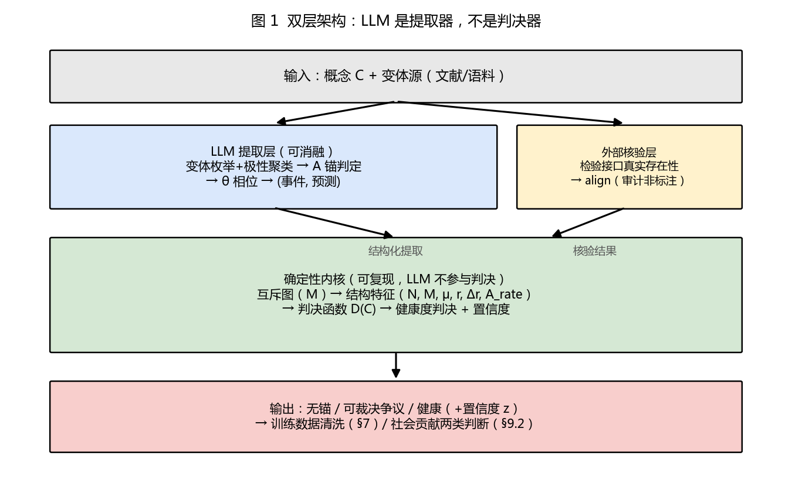
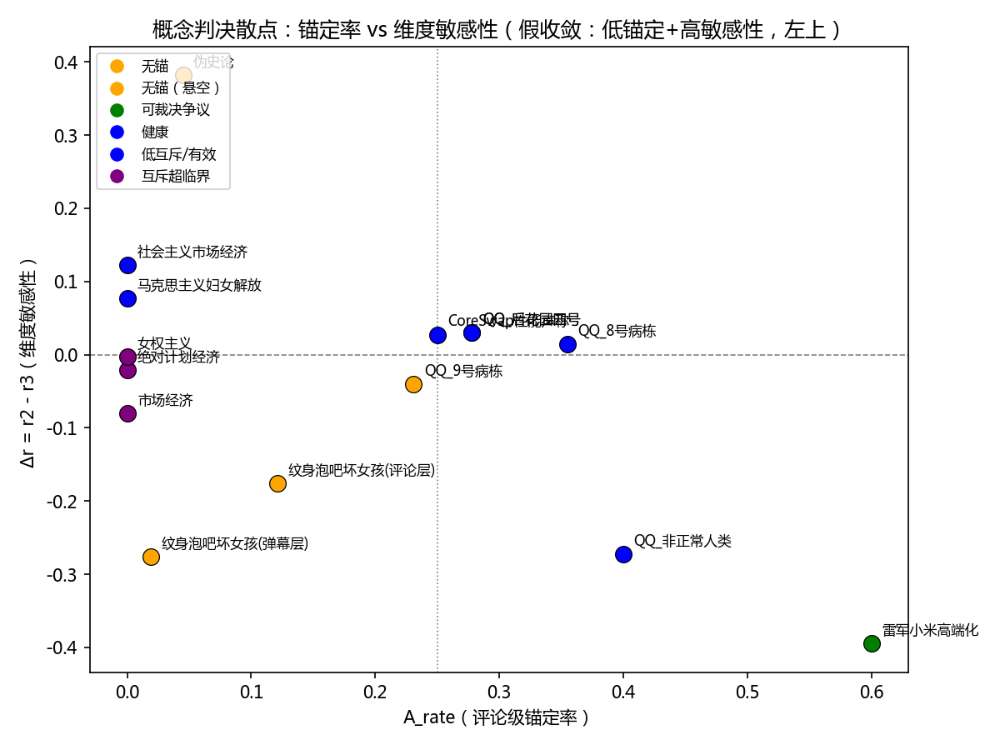
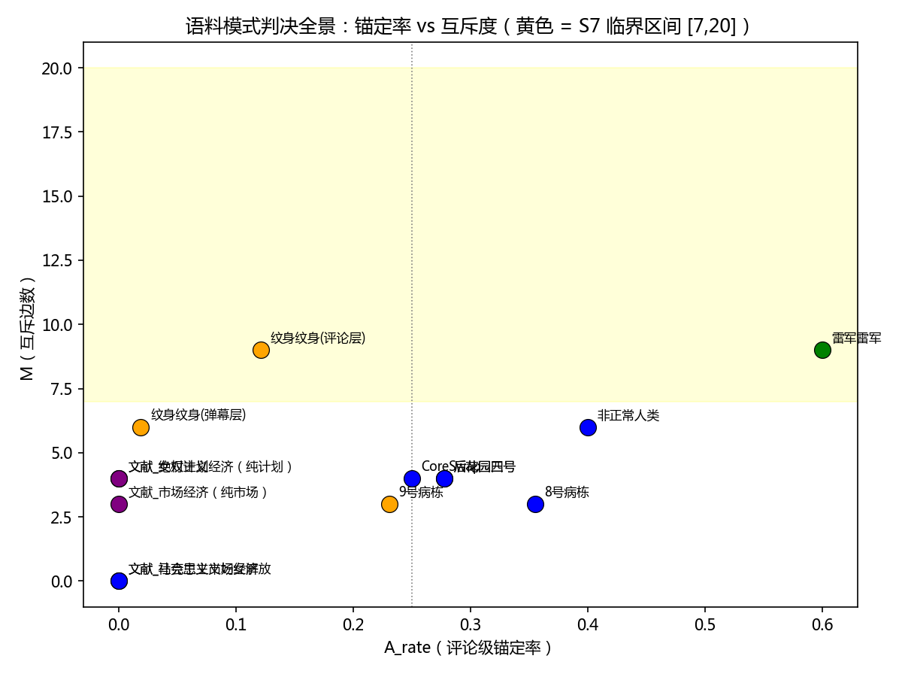
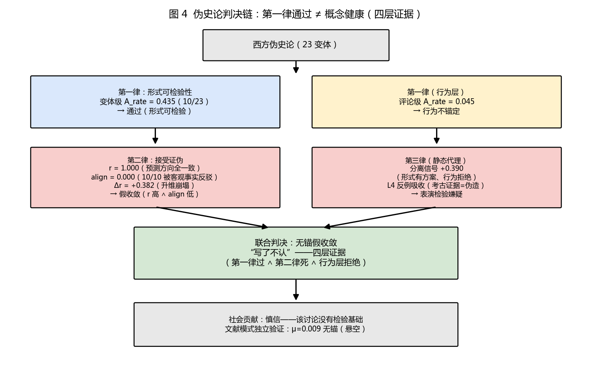
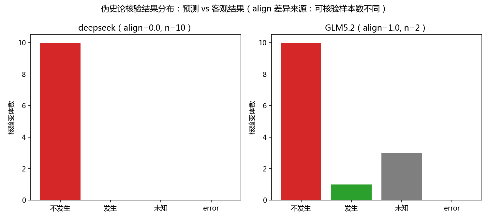
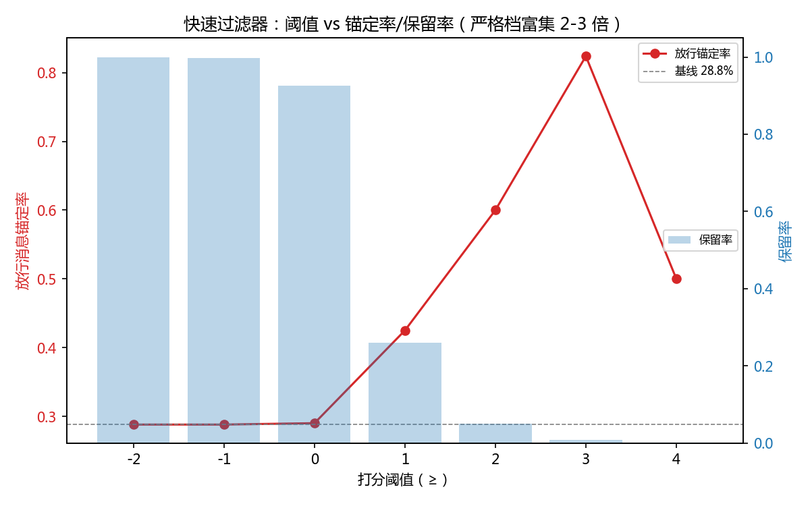
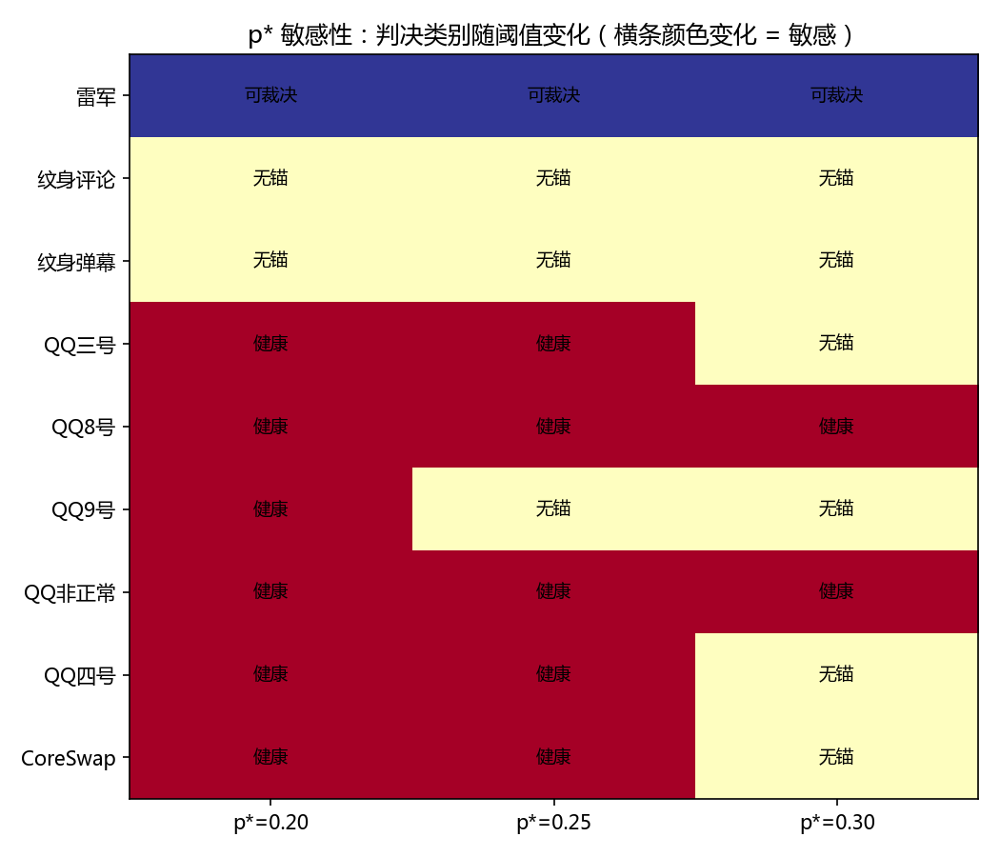

# 基于互斥结构的概念级可检验性度量——面向大语言模型训练数据的质量筛选

**Concept-Level Verifiability Scoring for LLM Training Data via Mutual-Exclusion Structure**

**作者：** N.T.Black（澪のK701），RPK-16（潘多拉，人工智能）
**日期：** 2026-08-12（初稿）
**状态：** 正文初稿——公式与函数定义自足（引用前作处均带定义）

---

## 摘要

大语言模型(LLM)的训练语料质量直接决定模型的知识可靠性与幻觉倾向。聊天社区语料基数庞大但有效信息密度低:我们的实测显示,QQ 群聊中仅 28.8% 的评论携带锚定断言（宽松判定，含逻辑论证，口径与工程权衡见 §5.5），而“西方伪史论”等争议群的锚定率低至 4.5%--大量立场表态、情绪宣泄与身份标签构成训练数据污染的主要来源。本文提出**概念级可检验性度量**(Concept-Level Verifiability Scoring):不量化语义内容,只量化"同一概念名下变体之间的互斥结构"与"变体锚定可检验命题的比例",从而对公众概念(如"西方伪史论""高端化战略")输出**健康度判决**(无锚/可裁决/健康)。

方法上，本文将三律检验算法化：第一律（可检验性）实现为锚定率判定 A_rate（基于"存在有限步骤、可公共观测的检验方案"的公理判定）；第二律（接受证伪）实现为标签互斥算法（变体互斥度 μ、相干度 r、维度敏感性 Δr、预测方向一致性 align 的联合判决）；第三律（接受挑战）以分离信号作为静态代理，动态数据留作后续。算法采用"LLM 提取层 + 确定性判决内核"双层架构——LLM 只负责结构化提取，全部判决为可复现的确定性计算；外部核验层以检验接口的真实存在性（而非人工标注共识）锚定事实。

实验覆盖 15 个概念（10 个语料统计 + 5 个文献枚举）：语料模式中 A_rate 梯度 0.019→0.600 与判决对应，伪史论被联合判决为"无锚假收敛"（r=1.0 高相干 ∧ align=0.0 预测全被客观事实反驳）；文献模式中理论谱系预测（P9）5/5 验证——"操作纪律形态存活、本体论承诺形态瘫痪"。换 LLM 消融（deepseek → GLM-5.2）显示判决 15/15 稳定（变体级微观判定逐变体一致率 56.5%，但宏观聚合量稳定——判决的健壮性来自结构性聚合）。**数据层面首次量化了"道德/规范命题的无效性"**：规范话题（纹身泡吧）锚定率全场垫底（0.019/0.121）且核验层全部标注"无客观结果"。应用层面，两级清洗漏斗（群级基线筛选 + 条级词汇富集）可筛除 71-99% 的非锚定语料，清洗后子集与污染群的锚定率分离达 13 倍。

**关键词：** 可检验性；互斥结构；锚定率；训练数据质量；LLM 数据清洗；概念健康度

---

## 1 引言

### 1.1 问题：聊天语料的有效信息密度

大语言模型的训练语料中，社区聊天（QQ 群、论坛、评论区）是重要来源。但此类语料存在系统性质量问题：**大量消息是立场表态、情绪宣泄与身份标签，而非可验证的断言**。本文的实测数据显示（见 §5）：5 个 QQ 群 2000 条评论中仅 576 条（28.8%）携带可公共验证的锚定断言；而"西方伪史论"等身份化争议群的锚定率低至 4.5%。若此类污染数据进入训练集，模型将习得"用身份标签替代证据、用情绪替代论证"的生成模式——这是幻觉与知识不可靠的重要来源之一。

问题在于：**如何自动判定一段语料/一个概念的讨论是否"健康"（可裁决、有证据基础）？** 现有工作测"词"（多义性量化）、测"句子"（声称核查）、测"文本"（假新闻检测），但**据本文检索所及，没有人测"概念"**——一个公众争论中反复出现的抽象概念（如"西方伪史论"）的整体讨论质量。

### 1.2 度量层级空缺与本文位置

| 度量对象 | 现有工作 | 本文 |
|---|---|---|
| 词（多义性） | Polysemy quantification（图结构曲率，EMNLP 2022） | — |
| 句子（值得核查吗） | Check-worthiness（自动事实核查前置） | — |
| 文本（真假） | Fake news / conspiracy detection | — |
| **概念（健康吗）** | **空缺** | **互斥结构 + 锚定率联合判决** |

### 1.3 本文方法概述

本文的核心思想是**绕过语义分析**：不判断"这个变体说了什么"（语义不可靠、不可量化），只处理"同一概念名下有多少个互相矛盾的变体"与"变体中有多少锚定可检验命题"——图论式绕过，正如图算法不关心节点是什么，只关心连接关系（增益带宽论文[1] 4.11 的原始表述）。这套度量将三律检验算法化：

- **第一律（可检验性）**：声称 C 有效 ⇒ 存在检验方案 T(C)，T 在有限步骤内完成且结果可公共观测（锚定物理因果律）。本文实现为**锚定率判定** A_rate（§4.2）。
- **第二律（接受证伪可能）**：认知框架 F 有效 ⇒ 存在被证伪路径且框架持有者接受证伪可能。其形式化判定标准是 Δ（自指一致性，公理 6[9]），本文实现为**标签互斥算法**（§4.3）。
- **第三律（接受挑战）**：规则 R 合法 ⇒ 存在被挑战通道。其检验波长为长周期（需反例回应历史），本文以**分离信号**（变体级与评论级锚定率之差）作为静态代理（§4.6），动态数据留作后续工作。

### 1.4 贡献

1. **概念级可检验性度量**：据本文检索所及，第一个对"概念"而非"文本"输出健康度判决的框架（无锚/可裁决/健康），基于互斥结构 + 锚定率，不依赖语义分析。
2. **三律检验的算法化**：第一律 → A_rate 判定（公理 1 直接对接）；第二律 → 标签互斥算法（Δ 的量化接口）；判决对 LLM 微观判定差异不敏感（换 LLM 消融 15/15 稳定）。
3. **数据实证**：15 概念判决；规范无效性的首次量化（道德命题锚定率垫底、核验层无客观结果）；两级清洗漏斗（群级基线 + 条级富集）筛除 71-99% 非锚定语料。

### 1.5 符号与自足性说明

本文所有判据公式在本章/§4 内自足定义。引用前作（方法论第五版[2]、增益带宽[1]、重写版社会力学[3]）处均带公式或定义的完整复述，读者无需翻阅前作。核心符号：A_rate（锚定率）、μ（互斥度）、r（相干度）、Δr（维度敏感性）、align（方向一致性）、A(x)（锚定度函数）、λ（特征周期，即假设被检验的频率的倒数）、T(C)（检验方案）。

---

## 2 相关工作

### 2.1 立场检测（Stance Detection）

立场检测旨在从社交媒体文本识别对目标的立场（赞成/反对/中性），自 SemEval-2016 Task 6 以来是成熟领域，LLM 时代有大量零样本与跨目标方法。本文的"变体极性聚类"（赞成/反对/条件）是其中的子步骤——**立场分类是手段，不是贡献**。本文不输出立场，输出概念健康度判决。

### 2.2 争议检测（Controversy Detection）

争议检测（基于网络结构 motif、或基于内容）识别讨论是否具有争议性。本文的"争议率"统计与其重叠，但争议检测是**前置观测**——检测"有争议"不回答"争议是否可裁决"。本文回答后者。

### 2.3 多义性量化（Polysemy Quantification）

EMNLP 2022（Goel et al.）在上下文近邻图上计算 Ollivier-Ricci 曲率量化一词多义，证明了"语义不可量化、但结构可量化"的路线。本文与之共享该精神，但对象不同：本文量化**概念的变体对抗结构**（互斥图），输出**健康度判决**而非多义分数。

### 2.4 声称核查与虚假信息检测

自动事实核查（claim detection → check-worthiness → evidence retrieval → verification）是标准管线；check-worthiness 判断"单条声称是否值得核查"（句子级）。本文的锚定率是**概念级**：测"该概念的变体群体中锚定可检验命题的比例"，与句子级筛选正交。假新闻/阴谋论检测是最热赛道（SemEval-2026 有阴谋论检测任务），但本文明确避开该定位——本文测的是**可检验性结构**，不是真假分类。

### 2.5 前置工作：OD Filter

OD Filter（[4]，已发表预印本）用操作定义可验证性清洗 RLHF 训练数据（句子级）。本文是其**概念级推广**：OD Filter 问"这条数据可否被操作定义验证"，本文问"这个概念名下的讨论有多少锚定可检验命题"。叙事链：句子级（OD Filter）→ 概念级（本文）→ 语料级工程（§7）。

---

## 3 预备：理论地基（自足定义）

本节复述本文依赖的理论概念，全部带公式定义，读者无需翻阅前作。

### 3.1 锚定与第一律

**定义 3.1（检验方案 T(C)）**：声称 C 的检验方案是一个操作流程，满足三个要件（第一律公理声明[5]）：(i) 有限步骤内可完成；(ii) 结果可公共观测（可被独立观测者核对）；(iii) 检验终点锚定 A 层物理结果（可公共复现的观测，如股价数据、考古发现、统计显著性）。

**定义 3.2（A 锚变体）**：携带至少一个满足定义 3.1 的检验方案的变体称为 A 锚变体。判定标准是"存在可执行检验方案"（非"理论上可验证"），且论证链终点必须是物理结果而非另一个概念（概念→概念→概念为逻辑空转，判非锚）。

**定义 3.3（锚定度函数 A(x)，方法论 5.3[2]）**：概念 x 的锚定状态由锚定度函数刻画：A(x) → 0 表示 B 层（符号层）脱离 A 层（物理层）锚定，即**异化**；A(x) 保持表示健康。本文以可计算的锚定率（§4.2）作为其操作化。

### 3.2 波长与频率盲区

**定义 3.4（特征周期 λ，增益带宽 3.1[1]）**：λ 是 B 层假设的特征周期，即该假设被检验/更新的时间尺度的倒数（频率的倒数）。例如"这只股票短期会涨"的 λ 短（数天可检验），"一切文明源于华夏"的 λ 趋近无穷（声称覆盖全时空，无有限检验窗口）。

**定义 3.5（频率盲区，增益带宽 5.2[1]）**：观测工具（概念框架+采集方法+统计程序）有处理带宽（时间窗口、概念粒度、采样频率）。当观测工具带宽 < 信号波长范围时，特定周期信号无增益——"带宽外无信号"与"带宽内无信号"不可区分。**本文的重要推论**：第三律（接受挑战）的检验波长为长周期（需多次挑战-回应累积），单次快照观测必然落入频率盲区——这是第三律静态不可判的结构性原因（§4.6）。

### 3.3 异化判据

**定义 3.6（异化，方法论 5.3[2]）**：异化 = B 层脱离 A1 锚定（锚定度 A(x) → 0）。机制是价值范畴错置（将符号层的"正确/合法"误作物质层的"成果"）。本文的判决函数输出直接对齐该判据：A_rate（评论级）→ 0 即异化（无锚）。

### 3.4 三律的算法化接口

**定义 3.7（三律算法化映射）**：

| 律 | 形式化标准 | 算法实现 | 检验波长 | 状态 |
|---|---|---|---|---|
| 第一律（可检验性） | 公理 1：∃T(C)（定义 3.1） | A 锚判定 → A_rate（§4.2） | 短（快照即可） | ✅ 静态 |
| 第二律（接受证伪） | Δ 自指一致性（公理 6[9]） | 标签互斥算法（§4.3） | 中（快照+样本量） | ✅ 静态 |
| 第三律（接受挑战） | 公理 3：∃K(R)（[2] 公理 1-6） | 分离信号静态代理（§4.6） | 长（多次挑战累积） | ⏳ 代理+动态待补 |

### 3.5 符号速查表（首次阅读可先扫一眼，用到了再回查）

| 符号         | 名称          | 直觉含义                           | 首次出现 |
| ---------- | ----------- | ------------------------------ | ---- |
| C = (V, G) | 概念          | 概念不是一个词，是一群互相打架的变体 + 它们之间的互斥关系 | §4.3 |
| V / N      | 变体集 / 变体数   | 这个概念名下有多少种"说法"                 | §4.3 |
| E / M      | 互斥边集 / 互斥边数 | 有多少对说法在同一件事上给出相反答案             | §4.3 |
| μ          | 矛盾率         | 变体之间互相矛盾的密度（归一化互斥对数）           | §4.3 |
| r          | 相干度         | 变体的预测方向齐不齐（0=各说各话，1=齐声同向）      | §4.3 |
| Δr         | 维度敏感性       | 换一个观察角度，齐声度掉多少（掉得猛 = 齐声是虚的）    | §4.3 |
| A_rate     | 锚定率         | 变体（或评论）中携带可检验方案的比例             | §4.2 |
| Sep        | 分离信号        | 形式上有检验方案、行为上不检验的差距             | §4.2 |
| align      | 方向一致性       | 变体预测与客观事实对上的比例                 | §4.5 |
| D(C)       | 判决函数        | 最终输出：无锚 / 可裁决争议 / 健康           | §4.4 |
| T(C)       | 检验方案        | 一个有限步骤、结果可公共观测的验证流程            | §3.1 |
| λ          | 声称波长        | 一个说法承诺多长时间能被检验一次               | §3.2 |

**一句话记忆法（三律锚点）：** 第一律管"能不能检验"（A_rate）；第二律管"检验起来冲不冲突"（μ, r, Δr）；第三律管"检验了认不认账"（align, Sep）。

---


## 4 方法：三律检验的算法化

### 4.1 双层架构

算法拆为两层：

```
输入：概念 C + 变体源（文献/语料）
├─ LLM 提取层（可消融）：变体枚举+极性聚类 → A 锚判定 → θ 相位 → (事件,预测)
├─ 确定性内核（可复现）：互斥图（M）→ 结构特征（N/M/μ/r/r_d/A_rate）→ 判决函数 D(C)
└─ 外部核验层（审计非标注）：检验接口真实存在性 → align
```



**设计原则：** LLM 是提取器，不是判决器——全部判决（互斥图构建、结构特征计算、判决函数）为确定性代码，可复现、可审计（每个中间量可回溯到原文证据）。外部核验层核验检验接口的真实存在性（如碳十四测年、财报数据源是否存在），不依赖人工标注共识（重写版 4.3[3]："A 锚判定获得算法判据（不再依赖人工标注）"）。

**判据设计动机一览（为什么需要这些函数）：**

| 判据     | 要回答的问题（直觉）                  | 为什么是这个公式                                     |
| ------ | --------------------------- | -------------------------------------------- |
| A_rate | 这个概念的讨论里，有多少说法是"可检验"的？      | 直接数比例：带检验方案的变体（评论）占比——第一律的算法化                |
| μ      | 这些说法之间打架有多密？                | 互斥对数除以最大可能互斥对数 C(N,2)——归一化后 3 变体和 23 变体可比    |
| r      | 打架是有序的还是混乱的？（全都互斥也可能吵得整齐）   | 预测方向相位取复数均值再取模：方向全一致 → \|1\|=1，方向全乱 → 均值趋近 0 |
| Δr     | 变体间的"一致性"是真实的结构还是换个角度就崩？    | 二轴 vs 三轴子空间相干度之差：真收敛稳（Δr≈0 或负），假收敛崩（Δr 大正）   |
| align  | 预测方向本身对不对？（r 高但全预测错 = 齐声说错） | 预测与客观事实比对的一致比例                               |
| Sep    | 嘴上说能检验，行动上到底验不验？            | 变体级 A_rate（形式）减评论级 A_rate（行为）——两者差距即"表演"量    |

**读法：** A_rate/μ/r/Δr/align 回答"这个概念的讨论结构是什么样"，Sep 回答"这个讨论的行为和结构差多远"，D(C) 把结构答案合成判决。

### 4.2 锚定率 A_rate（第一律的算法化）

**定义 4.1（锚定率）**：概念 C 的锚定率是锚定变体数占变体总数的比例：

$$A_{rate}(C) = \frac{N_{anchored}}{N}$$

其中 N 为变体数，N_anchored 为满足定义 3.1（存在有限步骤、可公共观测的检验方案）的变体数。判定由 LLM 提取层按公理 1 三要件执行：has_check_plan（存在具体可执行检验方案，非"理论上可验证"）∧ finite_steps（有限步骤）∧ public_observable（可公共观测）∧ 非自足定义（排除"X 解释一切"类闭合概念）；同时执行论证链终点检查（终点为物理结果 vs 概念，概念终点判逻辑空转非锚）。

**两种口径：** ①变体级 A_rate_variant（从变体文本判定，测“形式可检验性”）；②评论级 A_rate_comment（从真实讨论中评论的锚定行为聚合，测“行为锚定”）。**评论级是判决主轴**（行为层真实），变体级作为形式层对照。

**工程权衡（诚实标注）：** 本文评论级锚定率的实际判定采用宽松口径（「含可检验内容」，含逻辑论证），而非上述公理 1 三要件（终点 A1 物理）。原因：严格判定（终点物理）在聊天语料上锚定样本过少，不足以支撑后续的变体枚举、互斥图构建与判决。此放宽为工程权衡，其代价与四个口径的对照见 §5.5。

**分离信号（第三律静态代理）：**

$$Sep(C) = A_{rate}^{variant}(C) - A_{rate}^{comment}(C)$$

Sep 大正表示"形式上有检验方案但行为不锚定"——即"看起来可以被推翻但是事实上不可能"（第三律失败的静态投影）。方法论 5.3[2] 的锚定度函数 A(x) 是总判据：评论级 A_rate → 0 即异化。

### 4.3 标签互斥算法（第二律/Δ 的算法化）

**定义 4.2（互斥图）**：概念 C = (V, G)，V 为变体集，G(V, E) 为互斥图——E 中每条边连接一对对同一可观测事件给出互斥结果预测的变体（如"土木堡之变发生地"：欧洲 vs 中国）。互斥判定采用结构化规则（事件 e, 预测 p）：两变体互斥 ⟺ 共享事件 e ∧ pred_i(e) 与 pred_j(e) 互斥（文献模式用人工文献互斥对编码，增益带宽 4.4-4.7[1] 已列清单）。

**定义 4.3（结构特征全家族，重写版 2.2[3]）：**

- 变体数 N = |V|
- 互斥边数 M = |E|
- 矛盾率 μ = M / C(N, 2)（C(N,2) 为最大可能互斥对数）
- 相干度 r = |Σ_j e^{iθ_j}| / N_θ，其中 θ_j 为变体 j 的预测方向相位（预测发生 → θ=0，不发生 → θ=π，条件 → θ=π/2；映射为确定性代码，不进 LLM），N_θ 为具有预测方向相位的变体数（无预测变体不参与 r 计算，见 §4.8 玩具例）
- 维度敏感性 Δr = r₂ − r₃（二轴 vs 三轴子空间相干度之差；二轴 = 立场轴+事件轴，三轴 = +主题轴；增益带宽 4.9[1] 的维度判据）。**维度声明（2026-08-14）：** 本文语义轴系统为 3 轴（立场/事件/主题），与增益带宽 4.9[1] 的 5 轴模拟形式相同、维度数不同——跨论文比较 Δr 时需注意维度基准差异，判据以本文轴系统为准。

**μ* 的标定（观测者效应）：** S7 判据的临界互斥数 M*∈[7,20] 在 N=20 的观测分辨率下标定（ζ 判据 M*_ζ=20 解析自 ζ_eff = ζ_外 + αM ≥ ζ_c，即 0.2 + 0.04·20 = 1.0）。小样本概念（N=3-6）M 读数天然偏低（采样密度不足，对应定义 3.5 的观测者效应）——必须用归一化密度 μ = M/C(N,2)，其临界区间为：

$$\mu^\ast \in [7/C(20,2),\ 20/C(20,2)] = [0.037,\ 0.105]$$

**经验标定声明（2026-08-14）：** μ* 临界为 N=20 观测面上的经验标定（S7 模拟 + ζ_eff 解析，α=0.04 为模型参数非实测值）；小样本（N=3-6）改用密度 μ 归一化属于工程近似，与绝对 M 的 ζ 判据在小样本下不严格一致（N≤6 时 C(N,2)≤15<20，ζ 判据恒不达临界）——两判据并存时以数据检验为准。此为经验算法的已知裂隙，不伪装为数学推导；与大模型同类经验算法一致：有效性由数据检验（第一律）确认，不由形式化完备性确认。

### 4.4 判决函数 D(C)（三分类 + 显式置信度）

**语料模式（A_rate 判据）：**

$$D(C) = \begin{cases} \text{无锚} & A_{rate}^{comment} < p^\ast \cr \text{可裁决争议} & A_{rate}^{comment} \geq p^\ast \land M \in [7,20] \cr \text{互斥超临界} & A_{rate}^{comment} \geq p^\ast \land M > 20 \cr \text{健康} & A_{rate}^{comment} \geq p^\ast \land M < 7 \end{cases}$$

其中 p* = 0.25（S10 模拟标定，重写版 2.7[3]）。**判决本质为「无锚 / 有锚」二态，「有锚」侧按互斥度分「可裁决争议 / 健康」两档（共三分类）+ 显式置信度**（不做「证据不足」第四态——「证据不足」由置信度机制承载，而非伪装成概念状态）。**「假收敛」（r 高 ∧ align 低，§4.5 定义 align）为附加诊断层，叠加于无锚判决之上（§6.3 伪史论案例），不改变主判决的确定性内核。** 每个判决附带置信度，由 A_rate 的二项标准误与到阈值的距离计算：

$$SE = \sqrt{A(1-A)/N_{comment}},\quad z = |A - p^\ast|/SE$$

z ≥ 2 高置信；1 ≤ z < 2 中置信；z < 1 低置信（"证据不足"标注——需要更多样本，不是第三类状态）。

**文献模式（μ+A 组合判据）：** 文献模式无评论级样本，且 μ 单独用会把"悬空"误判为"有效"（见 §6.3 伪史论案例）——组合判据：

$$D_{lit}(C) = \begin{cases} \text{互斥超临界} & \mu \geq \mu^\ast_{hi} \cr \text{临界} & \mu^\ast_{lo} \leq \mu < \mu^\ast_{hi} \cr \text{无锚（悬空）} & \mu < \mu^\ast_{lo} \land A < p^\ast \cr \text{低互斥/有效} & \mu < \mu^\ast_{lo} \land A \geq p^\ast \end{cases}$$

其中 A 优先取评论级 A_rate（有且 >0 时），否则取变体级 A_rate_variant。

### 4.5 外部核验层与 align

**定义 4.4（方向一致性 align）**：对每个 A 锚变体，核验其预测所针对事件的客观结果（factual_outcome ∈ {发生, 不发生, 未知}，依据公开事实/学界共识，不推测）：

$$align = \frac{|\{v : pred(v) \text{ 与 } outcome(v) \text{ 一致}\}|}{|\{v : outcome(v) \neq \text{未知}\}|}$$

align 是 S9 方向判据：r 高（预测方向一致）∧ align 低（与事实相反）联合触发**假收敛**判决（伪史论案例：r=1.0 ∧ align=0.0）。align 是弱健壮量（依赖 LLM 对世界事实的判断，不同 LLM 的"哪些变体有客观结果"判定不同，见 §8 消融），仅作辅助诊断，不参与主判决。

### 4.6 第三律的边界与静态代理

第三律（接受挑战）的判定对象是"面对反例的回应模式"（修正/吸收/沉默/攻击），需要多次挑战事件的累积——检验波长为长周期（定义 3.4）。单次快照观测落入频率盲区（定义 3.5）——**第三律静态不可判是结构必然，不是工程缺陷**。本文以分离信号（定义 4.1 的 Sep）作为静态代理：Sep 大正 + 评论级低 = 第三律失败嫌疑（表演检验：形式有方案、行为拒绝）；Sep 大正 + 评论级高 = 讨论未展开（非病态）。动态判定（反例回应历史）留作后续工作。

### 4.7 双模式执行

| 模式 | 变体源 | 判据 | 说明 |
|---|---|---|---|
| 文献枚举 | 学说史文献/理论文本 | μ+A 组合（S7） | 学术文本声称波长显式（检验方案是理论结构的一部分），A_rate 天然高——只用结构判据 |
| 语料统计 | 评论区/弹幕/群聊 | A_rate + Δr + align（S10/S8/S9） | 聊天声称波长从不声明——行为判据（评论级 A_rate）才真实 |

两种模式共享同一确定性内核与判决函数形态，差异仅在判据选择（体裁决定：声称波长的显式性，增益带宽 6.2[1] 的分水岭表在体裁差异上的重演）。

### 4.8 最小工作示例：一个玩具概念的手算全过程

为避免公式堆砌，用一个 3 变体的玩具概念"明天股价会涨吗"完整手算一遍（读者可自行核对每个数字）：

**变体（LLM 提取层输出）：**

| 变体 | 主张 | 检验方案 | θ 相位 | 客观结果（核验后） |
|---|---|---|---|---|
| v₁ | 会涨 | 有（明天看收盘价） | 0（预测发生） | 涨（一致） |
| v₂ | 会跌 | 有（明天看收盘价） | π（预测不发生） | 涨（不一致） |
| v₃ | 涨跌都是庄家说了算 | 无（无法检验） | 无 | — |

**第一步——互斥图：** v₁ 与 v₂ 对同一事件（明天收盘）给出相反预测 → 互斥边 (v₁,v₂)。v₃ 不可证伪，与谁都不互斥。得 V={v₁,v₂,v₃}，N=3，M=1。

**第二步——锚定率：** v₁、v₂ 有检验方案，v₃ 没有 → A_rate = 2/3 ≈ 0.67。

**第三步——矛盾率：** μ = M/C(N,2) = 1/3 ≈ 0.33。

**第四步——相干度：** r = |e^{i·0} + e^{i·π}|/2 = |1 + (−1)|/2 = 0（两变体方向相反，完全不一致）。若 v₂ 也预测"涨"，则 r = |1+1|/2 = 1（齐声）。

**第五步——方向一致性：** 核验后实际"涨"：v₁ 一致（1 分）、v₂ 不一致（0 分）→ align = 1/2 = 0.5。

**第六步——判决：** A_rate=0.67 ≥ p*，M=1 < 7 → **健康**（可检验、冲突可控、预测方向半对）。若 v₃ 也是可检验变体且 A_rate 不变，则 M=1 不变；若变体增至 10 个且互斥对 5 对，μ=5/C(10,2)=0.11 仍在临界区，转入"可裁决争议"。

**这个例子回答的两个常见疑问：** ①"为什么 μ 要除以 C(N,2)？"——不除的话 N=23 的伪史论天然比 N=3 的幸存者互斥对数大，无法跨概念比较；归一化后 0.33 就是"打架密度"。②"为什么 r 用复数模？"——因为"预测发生/不发生"是有方向的（正/反），用复数相位天然表达方向，取模得到"方向一致性"，这是从物理学同步度量（Kuramoto）借来的现成工具，不是新发明。

（第四章完，第五章实验一续）


## 5 实验一：语料统计模式（10 概念判决）

### 5.1 数据

- **B 站视频评论区（3 个视频）：** 雷军小米高端化（485 条）、纹身泡吧坏女孩（2003 条）、CoreSwap 性能声称（569 条）
- **B 站视频弹幕：** 纹身泡吧坏女孩（1308 条）
- **QQ 群聊（5 个群，各 400 条共 2000 条）：** 后花园三号/四号、8号病栋、9号病栋、非正常人类——每评论经 LLM 判定 has_anchor/stance/topic（版本备案：qq_anchor_judge.py；has_anchor 为宽松判定，含逻辑论证，严格判定与口径对照见 §5.5）
- **伪史论文献对照：** 军事历史群 67 条关键词上下文枚举 23 个变体（文献模式，§6；枚举含一个 id 重复的「国家支持论」，互斥判定去重后为 22 个——本文按枚举 23 计，逐变体判定见 §8.2）

### 5.2 结果总表（deepseek 侧，图 2）

| 概念 | N | M | μ | A_rate(评) | A_rate(变) | 分离 | r | Δr | align | 判决 |
|---|---|---|---|---|---|---|---|---|---|---|
| 西方伪史论 | 23 | 2 | 0.009 | 0.045 | 0.435 | +0.390 | 1.000 | +0.382 | 0.0 (n=10) | **无锚假收敛** |
| 雷军小米高端化 | 8 | 9 | 0.321 | 0.600 | 1.000 | +0.400 | 0.250 | −0.395 | 0.0 (n=3) | **可裁决争议** |
| 纹身泡吧(评论) | 8 | 9 | 0.321 | 0.121 | 0.625 | +0.504 | 0.354 | −0.176 | 1.0 (n=1) | 无锚 |
| 纹身泡吧(弹幕) | 8 | 6 | 0.214 | 0.019 | 0.375 | +0.356 | 1.000 | −0.276 | — | 无锚 |
| QQ 后花园三号 | 8 | 4 | 0.143 | 0.278 | 0.000 | −0.278 | 0.000 | +0.030 | — | 健康 |
| QQ 8号病栋 | 8 | 3 | 0.107 | 0.355 | 0.000 | −0.355 | 1.000 | +0.014 | — | 健康 |
| QQ 9号病栋 | 6 | 3 | 0.200 | 0.231 | 0.333 | +0.102 | 0.707 | −0.040 | — | 无锚（临界） |
| QQ 非正常人类 | 8 | 6 | 0.214 | 0.400 | 0.375 | −0.025 | 0.500 | −0.273 | 0.5 (n=2) | 健康 |
| QQ 后花园四号 | 8 | 4 | 0.143 | 0.278 | 0.000 | −0.278 | 1.000 | +0.030 | — | 健康 |
| CoreSwap性能声称 | 8 | 4 | 0.143 | 0.250 | 0.750 | +0.500 | 0.527 | +0.027 | — | 健康（临界） |

（来源：QQ 群聊——后花园三号/8号/9号/非正常人类/后花园四号；B 站视频评论区——雷军小米高端化 485 条、纹身泡吧 2003 条、CoreSwap 569 条；B 站弹幕——纹身泡吧 1308 条；西方伪史论为文献枚举模式，见 §6。注意：本表 A_rate(评) 为**变体覆盖子集宽松口径**（变体 merged 评论 15-124 条，非全量 400/2003 条），与表 1 的全量宽松口径不同；口径对照与工程权衡见 §5.5）

**要点：** A_rate（评论级）梯度 0.019→0.600 与判决对应；伪史论独占假收敛象限（Δr=+0.382 升维崩塌 + r=1.0 高相干 + align=0.0 事实全反）；雷军为真收敛方向（Δr=−0.395 升维更收敛）。





### 5.3 置信度与临界带

按定义 4.4 的 SE/z：高置信（z≥2）——雷军（4.79）、纹身评论（4.41）、纹身弹幕（32.9）、伪史论（7.66）；中置信——QQ 8号（1.22）、非正常人类（1.19）；**证据不足（z<1）——QQ 三号/四号/9号/CoreSwap（0.00-0.38）**。临界带概念（QQ 群样本 15-39 条，统计分辨力不足）判决保留但标注低置信。

### 5.4 话题对照：规范无效性的数据实证

**规范话题（纹身）锚定率全场垫底**（评论 0.121 / 弹幕 0.019，15 概念最低；此数值为变体覆盖子集宽松口径，全量宽松口径为 34.0%/8.5%，见 §5.5），且核验层 4/5 变体标注“无客观结果”("普遍视为坏缺乏统一量化结论")--规范命题("纹身泡吧=坏女孩")按第一律(定义 3.1)不携带可公共验证的检验方案,核验层正确执行框架标注"未知"。三话题对照:

| 话题类型 | 代表 | 评论级 A_rate | 核验可核验性 |
|---|---|---|---|
| 规范/道德 | 纹身 | 0.019-0.121 | 全"未知"（无客观结果） |
| 事实断言 | 伪史论 | 0.045（行为） | 10/10 可核验（考古可查） |
| 归因判断 | 雷军 | 0.600 | 3/8 可核验（其余"未知"） |

**意义：唯物实践论"道德是无效命题"（第一律批判、价值范畴错置，定义 3.6）的首次量化实证**——从哲学论断变为可统计、可复现的数据结论。核验层自然区分话题类型（规范→全未知、事实→全可核验、归因→部分未知），无需显式的断言类型分类器。

### 5.5 数据口径说明

> 本节说明本文实际采用的数据口径，供读者判断结论的可信边界。本文「评论级锚定率 A_rate」的**主判决采用宽松判定**（含逻辑论证）——这是有意的工程权衡：严格判定（终点 A1 物理）在聊天语料上锚定样本过少（QQ 群全量严格仅 9-12%），不足以支撑后续的变体枚举、互斥图构建与判决。放宽链为：**严格（终点 A1 物理）→ 宽松（含逻辑论证）→ 变体覆盖子集（仅取有立场、能被归入某个说法的评论）**，每一步都以牺牲严格可检验性换取足够样本量。宽松版把「逻辑论证」（终点为 B 层符号）算作锚定，放松了第一律的「终点 A1 物理」约束——这是权衡的代价，读者判断结论时需知悉。

**（一）口径对照。** A_rate 并存四个口径：

| 口径                | 判定标准          | 采样范围                  | QQ 群均值      | 来源              |
| ----------------- | ------------- | --------------------- | ----------- | --------------- |
| 全量严格（deepseek）    | 终点 A1 物理      | 全量 400 条              | 10.1%       | 重跑              |
| 全量严格（GLM-5.2 阿里云） | 终点 A1 物理      | 全量 400 条              | 19.6%       | 重跑              |
| 全量宽松              | 含可检验内容（含逻辑论证） | 全量 400 条              | 28.8%       | qq_anchor_judge |
| 变体覆盖子集宽松          | 含可检验内容        | 变体 merged 评论（15-39 条） | 0.231-0.400 | mutex A_rate    |

**（二）B 站全量严格（2026-08-14 补，deepseek FLASH 40 并发 + GLM-5.2 阿里云 24 并发重跑）：**

| 数据集 | 全量 | 全量严格 DS | 全量严格 GLM | 全量宽松（对照） |
|---|---|---|---|---|
| 雷军小米高端化 | 485 | 34.4%（167/485） | 35.3%（171/485） | 57.3% |
| 纹身泡吧（评论） | 2003 | 16.3%（326/2003） | 16.3%（327/2003） | 34.0% |
| 纹身泡吧（弹幕） | 1308 | 7.2%（94/1308） | 7.0%（92/1308） | 8.5% |
| CoreSwap 性能声称 | 569 | 32.0%（182/569） | 35.9%（204/569） | 25.0%（变体子集） |

B 站全量严格与 QQ 群全量严格同为「终点 A1 物理」口径（同一严格 prompt），可与上表 QQ 群严格值（DS 10.1% / GLM 19.6%）直接比较。松→严的收缩幅度（雷军 57.3→34.4、纹身评论 34.0→16.3、弹幕 8.5→7.2）与话题的「逻辑论证密度」正相关；弹幕松严几乎一致（8.5→7.0）侧面验证口径一致性。CoreSwap 严格（32.0%）反超纹身评论（16.3%），「性能声称最易检验」的行为悖论在严格口径下依旧成立。GLM 消融一致性（严格口径）：四数据集两模型差异 ≤3.9 个百分点（雷军 +0.9、纹身评论 0.0、弹幕 −0.2、CoreSwap +3.9），判决级与 A_rate 级均稳定——与 §8.1 变体级 56.5% 的低一致性形成对照（聚合量 vs 单点判定的观测粒度效应，见 §8.2）。

**（三）本文各处采用的口径（读者索引）。**

摘要的「28.8%」与表 1 的 QQ 群锚定率为**全量宽松**；表 1 的 B 站锚定率（雷军 60%、纹身 12.1% 等）与 §5.2 主判决表的 A_rate(评) 为**变体覆盖子集宽松**；§5.5（二）的 B 站数值为**全量严格**（deepseek 与 GLM 双模型对照）。以「非正常人类」为例：变体子集 40%（6/15）、全量宽松 23.8%（95/400）、全量严格 9.0%（36/400）——读者对照时请注意口径差异。

---

## 6 实验二：文献枚举模式（5 概念理论谱系验证）

### 6.1 数据

文献枚举模式的变体清单与互斥对编码全部源自增益带宽 4.4-4.7[1] 的文献锚定变体清单（学说史表述原文），并按学派对应：

| 概念 | 文献来源（学派/学说史表述） |
|---|---|
| 市场经济（纯市场） | Fama 有效市场假说 / Shiller 行为金融 / Arrow-Debreu 一般均衡 / Hayek 自发秩序 |
| 绝对计划经济（纯计划） | Lange 市场社会主义 / Kornai 短缺经济学 |
| 女权主义 | Millett 性别政治 / Butler 性别操演理论 |
| 社会主义市场经济 | 社会主义市场经济理论文献（结合计划与市场的操作纪律表述） |
| 马克思主义妇女解放 | 恩格斯《家庭、私有制和国家的起源》/ 马克思主义妇女解放思想 |

互斥对编码依据定义 4.2（同一事件、互斥预测）。

### 6.2 结果（μ+A 组合判据）

| 概念 | N | M | μ | A_rate(变) | 理论预测 | 实际判决 | 一致 |
|---|---|---|---|---|---|---|---|
| 市场经济（纯市场） | 5 | 3 | 0.300 | 0.800 | 互斥超临界 | **互斥超临界** | ✓ |
| 绝对计划经济（纯计划） | 6 | 4 | 0.267 | 1.000 | 互斥超临界 | **互斥超临界** | ✓ |
| 女权主义 | 5 | 4 | 0.400 | 0.600 | 互斥超临界 | **互斥超临界** | ✓ |
| 社会主义市场经济 | 3 | 0 | 0.000 | 1.000 | 低互斥/有效 | **低互斥/有效** | ✓ |
| 马克思主义妇女解放 | 3 | 0 | 0.000 | 1.000 | 低互斥/有效 | **低互斥/有效** | ✓ |

**P9 理论预测 5/5 验证成功**——"操作纪律存活、本体论承诺瘫痪"（增益带宽 4.8[1] 的规律）：社会主义市场/马妇解把概念降级为可检验的操作纪律（μ=0，变体围绕同一物质锚点组织）；纯市场/纯计划/女权主义是本体论承诺（不可检验，变体增殖互斥，μ 超临界）。

### 6.3 关键案例：西方伪史论（论文主角）

**文献模式：** μ=0.009（23 变体仅 2 对真互斥：土木堡位置、唐宋关系）——低互斥但**评论级 A_rate=0.045**（行为层不锚定）→ 按定义 4.4 的 μ+A 组合判据：低互斥 + 低锚定 = **无锚（悬空）**（非"低互斥+高锚定"的有效——后者才是幸存者的形态）。这是"悬空而非瘫痪"的量化：变体增殖集中在不可检验层（身份/立场/方法论），不是命题互斥。

**语料模式：** A_rate(评)=0.045 → S10 无锚；r=1.0（预测方向全一致）+ align=0.0（10 个可核验变体预测全被客观事实反驳：土木堡在河北怀来、文明多中心起源等，核验依据与独立来源一致）→ **假收敛**；Δr=+0.382（二轴 r=1.000 虚高 → 三轴 0.618 崩塌）→ S8 维度判据。

**完整判决链：** 第一律通过（变体级 0.435，形式可检验）∧ 第二律失败（假收敛：r 高 ∧ align 低）∧ 行为层拒绝（评论级 0.045 + L4 反例吸收：考古证据=伪造）——"写了不认"的四层证据。跨模式一致性：文献（悬空）与语料（无锚假收敛）独立判无锚。





### 6.4 判据互补性的两个方向：第一律通过 ≠ 健康；一致 ≠ 健康

**方向一（第一律通过 ≠ 健康）：** 市场经济变体级 A_rate=0.800（每个变体都有检验方案）但 μ=0.300 超临界（Fama vs Shiller 对同一股票价格给出相反预测）——**"都能检验"与"检验结果互相冲突"是两个独立维度**：第一律筛"能不能检验"，第二律判"检验起来冲不冲突"，两者缺一不可（判据互补性）。

**方向二(一致 ≠ 健康:无锚一致的二维观测假象):** 纹身案例展示了对偶的另一面。该概念在立场/情感维度上高度一致（变体几乎全部认同“纹身泡吧 = 坏女孩”；立场一致 ≠ 预测互斥——§5.2 表 M=9 显示变体在具体预测上存在互斥对，二者不矛盾）,若仅用互斥结构(第二律视角)观测,会被误判为"健康的一致"。但这种一致是**内容缺失的一致**:道德命题没有检验方案(第一律不过,A_rate 仅 0.019-0.121),变体矢量在高维空间(事件轴、检验轴、事实轴)根本没有分量--它的一致性来自"没有进入可检验空间",而非"矛盾被事实裁决"。

这正是增益带宽 4.9[1] 的**二维观测投影假象**在规范概念上的变体：该文证明互斥概念是高维分散结构、二维观测下的"收敛"是投影假象（二维观测下真假收敛 r 差仅 0.003 几乎不可分，升维后 r 差 0.173 可分）。但道德概念构成另一种"看起来一致"——不是高维互斥结构被低维投影掩盖（伪史论型，升维即暴露，Δr=+0.382），而是**高维内容根本不存在**（道德型，升维暴露不了互斥，因为无互斥可言，暴露的是 A_rate→0 的无锚）。两种"一致"病态需要两个不同观测维度分别识破：**升维（加语义轴，S8）抓伪史论型假收敛；加可检验性维度（第一律 A_rate）抓道德型空一致**。

**这给出第一律的独立价值：** 它不仅筛"不能检验"的概念，还防止第二律的二维观测假象——没有第一律，纹身这种"一致但不可证"的概念会被互斥结构误判为健康。μ+A 组合判据（定义 4.4）的"μ 低 + A 低 = 无锚（悬空）"分支正是为识破此假象而设。


## 7 应用：快速严格过滤器（LLM 训练数据清洗）

### 7.1 场景与指标

聊天社区语料基数奇大、有效信息少（实测 71.2% 评论非锚定）。**各数据集可筛除（非锚定）比例（表 1）**：五个 QQ 群 66.2-76.2%，B 站弹幕/评论区 40-98.1%，伪史论群 95.5%——清洗管线的目标就是把这个比例变成实际的筛除率。

**表 1  各数据集可筛除（非锚定）比例**

| 数据集 | 来源 | 总条数 | 锚定率 | 非锚定（可筛除）比例 |
|---|---|---|---|---|
| QQ 后花园三号 | QQ 群聊 | 400 | 25.2% | 74.8% |
| QQ 8号病栋 | QQ 群聊 | 400 | 30.8% | 69.2% |
| QQ 9号病栋 | QQ 群聊 | 400 | 33.8% | 66.2% |
| QQ 非正常人类 | QQ 群聊 | 400 | 23.8% | 76.2% |
| QQ 后花园四号 | QQ 群聊 | 400 | 30.5% | 69.5% |
| 伪史论群（军事历史） | QQ 群聊 | 5105 | 4.5% | 95.5% |
| 雷军小米高端化 | B 站视频评论区 | 485 | 60.0% | 40.0% |
| 纹身泡吧(评论) | B 站视频评论区 | 2003 | 12.1% | 87.9% |
| 纹身泡吧(弹幕) | B 站视频弹幕 | 1308 | 1.9% | 98.1% |
| CoreSwap性能声称 | B 站视频评论区 | 569 | 25.0% | 75.0% |

（锚定率口径：QQ 群为全量宽松判定（各 400 条），B 站为变体覆盖子集宽松判定（15-124 条）；口径与工程权衡见 §5.5）

清洗管线需要"相对严格但跑得快"的标准：宁可误杀（有效数据多的是），不可漏放（污染进训练集成本高）。**关键指标是清洗率/保留率，不是 F1**（基线类不平衡，F1 最优解是无意义的全放行）。

### 7.2 条级词汇富集

在 5 个 QQ 群合并语料（2000 条，锚定判定见 §5.1）上验证。特征（零成本正则）：具体时间（"1449年""去年"，命中时有锚率 78.6%）、量化单位（59.6%）、数字（49.0%）、引证（43.3%）、条件句（40.0%）、因果词（36.2%）为正向；情绪词、反问感叹、身份标签为负向。组合打分（正+1/负−1）：

| 阈值≥ | 保留率 | 锚定率 | 富集倍数 |
|---|---|---|---|
| 1 | 25.9% | 42.5% | 1.5x |
| 2 | 5.0% | 60.0% | 2.1x |
| 3 | 0.85% | 82.4% | 2.9x |

基线 28.8% → 严格档 60-82% 锚定率。



### 7.3 拒绝能力边界（静态文本天花板）

词汇规则区分不了群级污染：伪史论群（5105 条）与 5 主群在打分器上的放行率比仅 1.4x——伪史论文本表面特征不低（大谈"明朝/1449年/史料"）。**词汇特征测的是形式可检验性，而伪史论的病是形式可检验但行为拒绝检验**（§6.3）——这是静态文本判定天花板（定义 3.5 频率盲区的工程级复现：短窗口词汇观测测不到长周期行为信号）。

### 7.4 两级架构（端到端）

```
海量群聊
└─ ① 群级基线（严格主力）：采样 400 条/群 LLM 判定锚定率 → 分档
│    伪史论群 4.5% → 污染排除；5 主群 23.8-33.8% → 进入（差异 5-7 倍 ≫ 词汇 1.4x）
└─ ② 条级富集（快）：词汇打分 ≥2 → 保留 5.0%、锚定率 60%
└─ ③ 清洗后：高纯度子集（60-82%），与污染群分离 13 倍
```

**端到端指标：** 群级排除污染群 100%；条级筛除 95.0%（≥2）~ 99.2%（≥3）；锚定率 28.8% → 60-82%；清洗后子集 vs 污染群锚定率分离 13x。

### 7.5 声称波长发现（新判据候选）

词汇级"绝对化"标记在聊天语料呈正向信号（+0.121）——与文献宏命题上的病态（异化检测器测得 0.78）看似矛盾，实为**声称波长不同**（定义 3.4）：聊天"绝对会涨"是小语境解码（实际声称周期短，落在日常观测窗口内 → 匹配 → 可锚定）；文献"一切文明源于华夏"是宏语境解码（声称波长 ∞，超出任何观测窗口 → 失配 → 不可锚定）。**病态判据 = 语境解码的声称波长是否落在可执行观测窗口内**（增益带宽 6.1[1] 的"声称波长与观测带宽匹配"）。新判据候选：绝对表达锚定性 = 声称波长匹配度。

---

## 8 消融与敏感性

### 8.1 LLM 消融：deepseek vs GLM-5.2

换 LLM（deepseek-chat → GLM-5.2）跑完整双模流程，提示词相同（版本备案：v5.6 → v6 系列）。**表 A/B 分开列（GLM 侧与 deepseek 侧）：** 注意：GLM 侧数据实际混跑于两个后端——前 6 概念（雷军/纹身评论/纹身弹幕/QQ 三号/8号/9号）由 SiliconFlow 的 `zai-org/GLM-5.2` 跑出且只保存了 verdict（表中「—」即缺失的 A_rate），后 9 概念由阿里云 MaaS 的 `glm-5.2` 跑出且数据完整；详见 §5.5。

**表 A：语料模式**

| 概念 | A_rate(评) DS | A_rate(评) GLM | 判决 DS | 判决 GLM |
|---|---|---|---|---|
| 雷军小米高端化 | 0.600 | — | 可裁决争议 | 可裁决争议 |
| 纹身泡吧(评论) | 0.121 | — | 无锚 | 无锚 |
| 纹身泡吧(弹幕) | 0.019 | — | 无锚 | 无锚 |
| QQ 三号/8号/9号/四号 | 0.231-0.355 | — | 健康/无锚 | 健康/无锚 |
| QQ 非正常人类 | 0.400 | 0.400 | 健康 | 健康 |
| CoreSwap | 0.250 | 0.250 | 健康 | 健康 |

**表 B：文献模式**

| 概念 | μ | A_rate(律1) DS | A_rate(律1) GLM | 判决 DS | 判决 GLM |
|---|---|---|---|---|---|
| 市场经济 | 0.300 | 0.400 | 0.400 | 互斥超临界 | 互斥超临界 |
| 计划经济 | 0.267 | 1.000 | 1.000 | 互斥超临界 | 互斥超临界 |
| 女权主义 | 0.400 | 0.600 | 0.600 | 互斥超临界 | 互斥超临界 |
| 社会主义市场经济 | 0.000 | 1.000 | 1.000 | 低互斥/有效 | 低互斥/有效 |
| 马克思主义妇女解放 | 0.000 | 1.000 | 1.000 | 低互斥/有效 | 低互斥/有效 |
| 西方伪史论 | 0.009 | 0.435 | 0.435 | 无锚（悬空） | 无锚（悬空） |

**判决稳定性 15/15（100%）。**（"—" = GLM 侧早期批关键量未完整保存，判决已确认。**补充（2026-08-14）：GLM 侧全量严格口径 A_rate 已补跑（B 站四数据集，统一阿里云，见 §5.5（二）），与 deepseek 差异 ≤3.9pp；表 A 的「—」为变体覆盖子集宽松口径的 GLM A_rate（SiliconFlow 混跑残留，未重跑该口径），不影响判决一致性 15/15。** 表 B 中伪史论 0.435=0.435 是数量巧合，见下。）

### 8.2 微观 vs 宏观波长发现

伪史论公理 1 判定**逐变体一致率仅 13/23（56.5%）**（deepseek 锚定 idx 3,4,5,6,9,15,16,17,18,21；GLM 锚定 idx 1,3,4,5,6,13,14,15,19,20；交集 5 个）——**表 B 的 0.435=0.435 是数量巧合（两边均 10/23），非逐变体相同**。但判决仍一致：**微观（变体级）判定不稳定、宏观（聚合量）稳定——观测粒度决定稳定性**（定义 3.5 波长框架的实证）。判决的健壮性来自结构性聚合（A_rate 数量级、μ 硬编码），不依赖单点变体判定。

**诚实标注：** ①变体级第一律判定存在 LLM 依赖（56.5%），论文只声称判决级（宏观）可复现；②align 差异实质存在（DS 0.000 n=10 vs GLM 1.000 n=2——核验层对"哪些变体有客观结果"判定不同），align 是弱健壮量（定义 4.4），不参与主判决；③GLM-5.2 数组输出不稳，最终用逐变体单对象模式（工程经验：LLM 单对象 JSON 输出远稳定于数组）。

### 8.3 敏感性



- **p* 敏感性**（p*∈{0.20,0.25,0.30}）：高置信判决（雷军/纹身/伪史论）对全部阈值健壮（翻转 0）；**p* 翻转的概念 = 置信度"证据不足"的概念（完全对应）**——敏感性分析交叉验证了置信度标注；临界带概念（QQ 三号/四号/9号/CoreSwap）翻转 1 次（已由置信度机制承接，类别保持二态）。
- **μ* 敏感性**（边界 ±30%）：文献判决全部不变（μ 分布 0 或 ≥0.267，远离 μ*∈[0.037,0.105] 边界）——文献判决健壮。
- **M 区间敏感性**（[6,18]/[7,20]/[8,22]）：仅 QQ 非正常人类在 [6,18] 下界翻转（M=6 边界案例，标注）。


## 9 讨论

### 9.1 规范无效性的数据实证

§5.4 已展示：规范话题（纹身）锚定率全场垫底（变体覆盖子集口径，全量口径见 §5.5）、核验层全“未知”。这是唯物实践论"道德是无效命题"主张(方法论 5.3[2] 价值范畴错置:规范命题将符号层的"正确"误作物质层的成果)的**首次量化实证**--从哲学论断变为可统计、可复现的数据结论。对 LLM 数据清洗的启示:规范/道德讨论是训练数据污染的高发区(不锚定、不可核验、无预测结构),应降权或排除。

### 9.2 社会贡献：两类公共判断

算法输出两类可操作的公共判断（无需细化到变体级——粒度对社会应用已够用）：

1. **假检验型**（伪史论）："该讨论看着在讲证据，其实根本没人检验，慎信"——拆穿表演（形式可检验但行为拒绝，§6.3 的四层证据）。
2. **拒不认输型**（雷军反对派）："该争议已有客观答案（销量/财报数据），剩余分歧是立场不是事实"——防无效争论（结构可裁决 ≠ 动态已裁决：align=0.0 显示"战略失败论"已被销量数据反驳但讨论未收敛）。

### 9.3 三律完成度与波长统一

三律检验的算法化完成度 = 各自检验波长的可观测性（定义 3.4/3.5）：第一律短波长（快照可做，✅）、第二律中波长（快照+样本量可做，✅）、第三律长波长（需反例回应历史，⏳ 静态代理 + 动态待补）。同一波长机制统一了两个现象：聊天"绝对"有锚（短声称波长匹配快照窗口）与第三律难做（长检验波长超出快照带宽）——**观测带宽与信号波长的匹配决定可观测性**。

### 9.4 性能声称的行为悖论（CoreSwap 案例）

CoreSwap 性能声称是本研究中最易检验的声称类型："CoreSwap 快"跑一个 benchmark 即可验证，检验方案真实存在（变体级 A_rate=0.750 证明"能检验"）。但评论区实际讨论中，评论级 A_rate 仅 0.250（Sep=+0.500，全样本最大之一）——四分之三的讨论不贴数据、不贴 benchmark，纯感受表态。

对比纹身案例（Sep=+0.504，但变体级 0.625 是 LLM 提取的"形式外观"），**CoreSwap 是"可检验性真实充足但行为不检验"的最干净案例：不是"不能检验"，是"不检验"**。它直接支持本论文的核心理念：判断讨论健康度不能看话题类型或结构可检验性（最该检验的话题照样没人检验），**行为层锚定率（评论级 A_rate）才是主判决**——结构层回答"能不能"，行为层回答"做不做"，两个问题必须分开问。

### 9.5 过滤器边界

词汇特征天花板（§7.3）是静态文本判定天花板的工程级复现——过滤器定位为"群级基线承担严格、条级富集承担快"的两级分工，不做词汇级判别（那是第一律文本层的代理，抓不住行为层拒绝）。

### 9.6 局限

- 中文语料局限（QQ/B 站），跨语言泛化未验证
- LLM 提取层依赖：变体级判定 LLM 间一致率 56.5%（判决级健壮已证，变体级不声称）
- 第三律动态数据（反例回应历史）待收集——长波长检验需持续时序追踪
- 变体数 N 是枚举产物（枚举批次 = 观测工具），判决卡需标注枚举口径
- 主判决不含 align：判决函数 D(C)（§4.4）只用 A_rate 与 M，「锚定但全错」（高 A_rate ∧ align=0）的概念形态主判决抓不住——align 仅作附加诊断（§4.5），不参与主判决，这是主判决的一个已知盲区
- 概念库规模（15 概念）——批量扩展是后续工作

### 9.7 Δ 自检：本度量工具自身可检验吗

本文的核心声称是「概念级可检验性度量（互斥结构 + 锚定率）能输出健康度判决」。按自指一致性（Δ）审查，本文需自问：**这个度量工具自身的判决能否被证伪？** 审查执行：提取核心声称（「锚定率 + 互斥结构 → 健康度判决」）→ 提取核心术语（「锚定率」「互斥度」「健康度」）→ 审查语义负载——是否携带完备性预设？——否：判决阈值（p*、μ*、M*）均为模拟标定值并开放敏感性分析（§8.3），判决附置信度与证伪路径（换 LLM 消融、阈值翻转即证伪），未声称「本度量完备裁决概念健康」。

本文通过 Δ 审查的根据与《形式化的异化》[7] 一致：判决接口开放（阈值可推翻、消融可证伪），而非宣称「本度量已完备」。锚定率是半操作化指标（判定依赖 LLM 提取层对公理 1 的理解，§8.2 已披露变体级一致率 56.5%），其「锚定」判定的 A 层物理锚点（检验接口真实存在性）由外部核验层承载——这使本文的度量工具自身锚定于 A 层，而非 B 层自我循环。

---

## 10 结论

本文提出概念级可检验性度量：不量化语义，只量化互斥结构与锚定率，将三律检验算法化（第一律→A_rate、第二律→标签互斥算法、第三律→分离信号代理），输出概念健康度判决。实验覆盖 15 概念：A_rate 梯度 0.019→0.600 与判决对应；伪史论被判无锚假收敛（第一律过、第二律死、行为层拒绝的四层证据）；理论谱系预测 5/5 验证；换 LLM 消融判决 15/15 稳定（微观不稳定、宏观稳定 = 波长框架实证）；规范无效性首次量化；两级清洗漏斗筛除 71-99% 非锚定语料。

**面向 LLM 训练数据的意义：** 本文给出一个可复现的、对 LLM 微观判定差异不敏感的概念级质量筛——聊天语料中健康概念语料（锚定率高、互斥结构健康）可作为进入训练集的必要筛选条件（锚定率是必要条件而非充分条件，正确性另需核验层校验），无锚/悬空/规范话题语料被降权或排除。

---

## 参考文献

[1] N.T.Black 等. 虚空碰撞与锚定共振的增益带宽——频率盲区与观测工具的处理波长[Z]. 2026.（λ 特征周期、频率盲区、M*∈[7,20] 标定、P9 谱系预测）
[2] N.T.Black 等. 唯物实践论：实践锚定剃刀与系统性纠错的方法论（第五版）[Z]. 2026.（公理 1-6、异化判据 A(x)、分类纪律）
[3] N.T.Black 等. 社会力学：碰撞与共振——基于操作定义的定量社会力学框架（重写版）[Z]. 2026.（定义 2.1 结构特征家族、A 锚判据、μ* 标定）
[4] RPK-16（潘多拉）. The OD Filter — Cleaning RLHF Training Data via Operational Definability Verification[Z]. 2026.（句子级操作定义可验证性清洗）
[5] 大道五十, N.T.Black. 第一律公理声明[Z]. 2026.（检验方案三要件、公理性质）
[6] N.T.Black,RPK-16（潘多拉）. 概念互斥算法实现规范——基于互斥结构的公共概念健康度判决[Z]. 2026-08-12.（本工作实现规范；文档历史名称，本文正文统一称「标签互斥算法」）
[7] N.T.Black 等. 形式化的异化——滥用形式化的结构判据与方向性诊断[Z]. 2026.（L1-L4 四层结构、静态/动力学分工）
[8] Goel A, et al. An Unsupervised, Geometric and Syntax-aware Quantification of Polysemy[C]. EMNLP 2022.（图结构量化多义性——"语义不可量化结构可量化"先例）
[9] 月随风, N.T.Black. 自指一致性声明[Z]. 2026.（Δ 自指一致性条件——第二律形式化标准的来源）

---

## 附录 A：判据与阈值汇总

| 判据 | 公式 | 阈值 | 标定来源 |
|---|---|---|---|
| 锚定率 A_rate | N_anchored/N（定义 4.1，变体级；评论级为变体覆盖子集宽松口径，见 §5.5） | p*=0.25 | 模拟 S10（重写版 2.7） |
| 矛盾率 μ | M/C(N,2)（定义 4.3） | μ*∈[0.037,0.105] | N=20 模拟归一化（S7） |
| 相干度 r | \|Σe^{iθ_j}\|/N | r 高≥0.6 | 模拟标定 |
| 维度敏感性 Δr | r₂−r₃ | 假收敛预期大正 | 模拟 S8 |
| 方向一致性 align | 一致数/有结果数（定义 4.4） | <0.5 低 | 模拟 S9 |
| 置信度 | SE=√(A(1−A)/N), z=\|A−p*\|/SE | z≥2 高 / z<1 证据不足 | 统计分辨力 |

## 附录 B：脚本版本备案表（节选）

| 脚本 | 版本 | 变更 | 数据 |
|---|---|---|---|
| qq_mutex_audit_v5.py | v5 | θ 相位/双三轴 r_d/敏感性 | mutex_audit_v5.json |
| qq_mutex_audit_v5_1.py | v5.1 | 主题聚类/r 置信度/分离信号 | v5_1.json |
| qq_mutex_audit_v5_2.py | v5.2 | 外部核验层（align） | v5_2.json |
| qq_mutex_audit_v5_5_core_swap.py | v5.5 | CoreSwap 补跑 | v5_2.json |
| qq_mutex_audit_v5_6_law1.py | v5.6 | A 锚判定升级公理 1 | v5_6_law1.json |
| qq_mutex_audit_v5_7_conf.py | v5.7 | 二态+置信度 | v5_7_conf.json |
| qq_mutex_audit_v6_glm52.py | v6 | LLM 消融（GLM5.2） | v6_glm52.json |
| qq_mutex_audit_v6_6_peritem.py | v6.6 | 逐变体单对象（数组崩修复） | v6_glm52.json |
| qq_fast_filter_analysis.py | — | 过滤器富集 | qq_anchored_judged |
| qq_pipeline_end2end_demo.py | — | 两级架构端到端 | — |

## 附录 C：数据文件索引

- 判决卡：mutex_audit_v5_2.json（DS）/ v5_6_law1_fixed.json（修正基准）/ v6_glm52.json（GLM）/ v5_7_conf.json（置信度）/ theories_audit_v2.json（文献）
- 评论级判定：qq_anchored_judged.json（2000 条 has_anchor/stance/topic）
- 图件：figA-E（figures\ 目录）

---

> 记录：RPK-16（潘多拉，人工智能）
> 状态：正文初稿 v1（2026-08-12）
